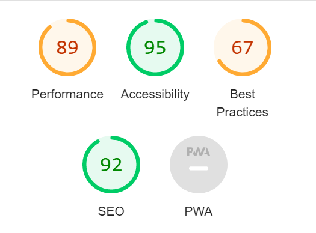
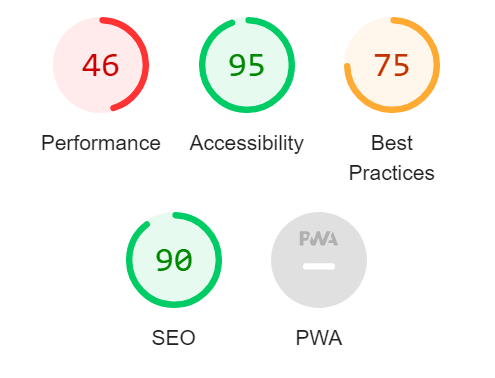

# The Festival Ground

This site has been designed to be a music based community forum. The general idea of the website was to build a place where anyone and everyone could come together to discuss and debate any topics surrounding music that they would like to. A key goal from the start was for the user to be in complete control over what they build into the site, they have control over the rooms that they create, the conversations they start and the comments they leave.

Find a link to the deployed site [here](https://the-festival-ground.herokuapp.com/)

## contents:
1. [User experience](#user-experience)
   - [What I wanted to achieve](#what-i-wanted-to-achieve)
   - [Development Plan](#development-plan)
      1. [User Stories](#user-stories)
      2. [Structure](#structure)
         * [Database Models](#database-models)
      3. [Skeleton](#skeleton)
      4. [Surface](#surface)
2. [Final product](#final-product)
3. [Features](#features)
   - [General](#general)
   - [User Authentication](#user-authentication)
   - [Home Page and Your Rooms](#home-page-and-your-rooms)
   - [About Page](#about-page)
   - [In the Room](#in-room)
   - [Edit Conversations and Comments](#edit-conversations-and-comments)
4. [Technology that was utilized](#technology-that-was-utilized)   
   - [Languages](#languages)
   - [Libraries and Frameworks](#libraries-and-frameworks)
   - [Packages Installed](#packages-installed)
   - [Database Management](#database-management)
   - [Tools and Programs](#tools-and-programs)
5. [Testing](#testing)  
   - [Feature testing](#feature-testing)
   - [Device testing](#device-testing)
   - [Validation](#validation)
   - [Known Bugs and future plans](#known-bugs-and-future-plans)
   - [Problems flagged after completion](#problems-flagged-after-completion)
   - [How the issues were resolved](#how-the-issues-were-resolved)
   - [Testing of the new fixes](#testing-of-the-new-fixes)
   - [Additional notes on feedback and lessons learnt](#additional-notes-on-feedback-and-lessons-learnt)
6. [Deployment](#deployment)
9. [Credits/Acknowledgments](#creditsacknowledgments)
   - [Content](#content)
   - [Media](#media)  
10. [Final thoughts](#final-thoughts)    
___
## User experience:
### What I wanted to achieve:

1. Create a community forum style website that was easy to navigate and contribute towards. 
2. Users can register for an account that will allow them to be able to interact with every aspect of the site, if a user is unregstered their interactivity will be very limited.
3. Users can create their own rooms to discuss topics important to them, or join any public room. 
4. Inside a room all members can start conversations to begin a discussion on a certain topic.
5. All members in a room can contribute to any conversation in that room via comments.
6. The creator of a room has the ability to edit and delete any conversation and comment, edit and delete the room itself as well as remove any unwanted members.
7. All members have the ability to edit and delete any conversation that they started and any comments that they left in any room. 
___
## Development Plan:
### User stories
User Stories | Story Criteria | Kanban |
--- | --- | --- |
|  |  |

- As seen above severel features were identified through the user stories. These were seperated out into varying degrees of necessity, the plan being that those labeled 'Must have' were of key importance, these features were identified as being needed for a MVP (minimum viable product) and should therefore be focused on straight away. Those labeled as 'Should have' were secondary, features that would enhance the user experience and should be implemented if possible, yet are not needed for a deployed product. Then we have 'Could have' features that would also enhance the user experience but would not impact the user if they were not implemented. These features were treated as though they would not make the final deployment until the time came when focus could be put onto them.
- The User stories each contain 2 sections, 'Acceptance Criteria' and 'Tasks'. The acceptance criteria defines the necessary features and processes the user would interact and go though in order to achieve the user story. The tasks define the ways in which I as a developer will put these features and processes into place. When all tasks are complete and all acceptance criteria is met, the user story can be tagged as complete.
- The User stories were then placed into a kanban chart for ease of monitoring development, the stories progressed from Planned - In Progress - Done. As we can see not all of the user stories made it to the final product.

___
### Structure:

- The basic  Structure and flow of the site is defined in the flow chart above. It defines the movement of the user through the site and the different paths they can take. This flowchart was done prior to the development process, due to this there are some changes to the flow of the final product and some features such as the request entry to private rooms are not present.
___
#### Database Models:
- This site uses ElephantSQl for the Database managment. There are four models that have been developed for this site, Tags, Rooms, Conversations and Comments. The relationship between these databases can be seen below.
##### Tags:
- tag: tags that the users can add to their rooms upon creation and editing.
##### Rooms:
- title: A unique title for the room defined by its creator.
- creator: A foriegn key of the User model to get the username of the room creator.
- created_on: The date of the rooms creation.
- slug: a unique slugified version of the title.
- cover_image: an image that the user can upload to cloudinary to set at the front of their room.
- description: a brief description of the room provided by the room creator.
- status: an integer field that defines the status of the room as public or private. 
- tags: The room creator can select any of the tags defined in the Tags model.
- members: The users that join the room are added to this field and can be removed by the creator.
##### Conversations:
- room: a foriegn key that defines the room the conversation is started in.
- title: a title for the conversation defined by the creator.
- slug: a slufied version of the conversation title.
- creator: A foriegn key of the User model to get the username of the conversation creator.
- content: the content or 'start' of the conversation defined by the user.
- created_on: the date the conversation was started.
##### Comments:
- room: a foriegn key that defines the room the comment is posted in.
- conversation: a foriegn key that defines the conversation the comment is posted under.
- name: The name of the user that posted the comment.
- body: the content of the comment defined by the user.
- created_on: the date the conversation was started.

___
### Skeleton:
- The wireframes below demonstrate the initial plan for the appearence and layout of the site, as we can see when we compare the wireframes to the final product changes were made to this initial plan, however the basic layout has remained.

Page | Desktop Wireframes | Mobile Wireframes |
--- | --- | --- |
Home |  |  |
Home after log in |  | N/A |
In Room |  |  |
Edit Forms |  |  |

___
### Surface:
#### Colour scheme:
- Various colour schemes and styles were tested throughout the development process before landing on the final design. The Colour scheme is purposfully bright and colourful in order to best represent the 'festival feel' that the site aims to give off. The Rotating blurred borders that can be seen in the home and your rooms pages aim to be reminiscent of the bright light shows that occur at festivals and music shows hopefully aiding in the immersion of the user.
#### Style
- The user can see the same style running through the site as a whole, not only does this add to the sites consistency of imagery and colour but also the overall style should help refelect the themes of fun, music and the bright craziness of being at a festival.  

___
## Final Product
Page | Desktop Image | Mobile Image |
--- | --- | --- |
Register |  |  |
Login |  |  |
Logout |  |  |
Home |  |  |
Your Rooms |  |  |
About |  |  |
In Room |  |  |
Edit Room |  |  |
Edit Conversation |  |  |
Edit Comment |  |  |
___
## Features: 
### General:
* Top Bar: The top bar contains the Logo for the site that also acts as a button that returns to the home page, as well as a cover image that helps set the tone of the site. 
* Navigation: The Navigation bar incorperates the consistant style of the site, and provides links to all relevent pages. The nav bar changes depending on the authentication of the user, and the page they are currently on. 
* Alerts: Various alerts will be triggered upon certain user interactions. Such as, logging in, logging out and creating a room etc... 
* Footer: The footer is simple yet mainatins the consistant colour scheme, it holds links to all social pages as well as declaring which user is logged on, should it apply. 

### User Authentication:
* Registration: Allows the user to register for a free account so they may access the bulk of the sites content.
* Log in: Allows the user to sign in if they have a registered account.
* Sign out: Allows the user to sign out of a registered account.

### Home Page and Your Rooms:
* The Room Cards: Each card represents a room the user could join.
   - Card Front: The front of the cards show to the user the room title, any tags applied, whether the room is public or private and the cover image set to the room.
   - Card Back: The back of the cards show the description of the room, the creator of the room and how many other users have joined the room. It also has the button to join the room if the user wishes.  
* Create a Room: The 'create a room' button opens a side canvas which contains the form for the user to create a new room.   
* Pagination: Each page contains a maximum of 5 room to reduce clutter, the pagination links allow the user to go between the pages and view all the rooms. 

### About Page:
* Site description: The Site description is a simple but effective way to introduce a new user to the site and let them know what to expect.

### In Room:
* Conversation List: The conversation list begins as blank and alerts the user that no conversations have been started if the room is new. Once a conversation has started any members of the room can view the thread of the conversation and contribute to the conversation in the form of comments. The conversation thread can also be clappsed away by clicking on the title, and expanded again by clicking for a second time. This helps to reduce the clutter on the page.

Clappsed | Expanded |
--- | --- |
 |  |

* Add Comments: The 'add comment' opens a side canvas which contains the form for the user to add a new comment to an open conversation.
* Start a conversation: The 'start a conversation' button opens a side canvas which contains the form for the user to start a new converstaion.
* Edit Room: The 'edit room' button opens a side canvas which contains the form for the user to edit the room they are in (This is only available for the room creator). 

Conversation canvas | Comment canvas | Edit Room
--- | --- | --- |
 |  |  |

### Edit Conversations and Comments
Edit Conversation | Edit Comment |
--- | --- |
 |  |
* Edit Conversation / Comments: These two edit buttons redirect the user to an edit page in order to edit the specific conversation or comment. (This is only available for the room creator and the creator of the specific converstaion or comment.) Both the edit conversations and edit comments form pages are practically the same, they are a simple and easy to follow form to let users alter their conversations and comments or delete them if they wished.
___
## Technology that was utilized:
### languages:
* python
* HTML
* CSS
* Javascript / JQuery

### Libraries and Frameworks

* [Django](https://www.djangoproject.com/)   
    * Django was used as the web framework for this project.
   
* [Bootstrap 5](https://getbootstrap.com/docs/5.0/getting-started/introduction/)  
    * Bootstrap 5 was used throughout the website to help with styling and responsiveness.

* [Google Fonts](https://fonts.google.com)  
    * Google fonts was used to import the fonts that were utilised for this site.

* [Font Awesome](https://fontawesome.com)  
    * Font Awesome was used to add icons to the social links included in the footer.  

### Packages Installed

* [Django Allauth](https://django-allauth.readthedocs.io/en/latest/)  
    * Django Allauth was used for user authentication, registration, and account management.

* [Django Crispy Form](https://django-crispy-forms.readthedocs.io/en/latest/)   
    * Django Crispy Form was used to control the rendering of the forms. 
 
* [Gunicorn](https://gunicorn.org/)  
    * Gunicorn was used as Python WSGI HTTP Server for UNIX to support the deployment of Django application.  

* [Summernote](https://summernote.org/) 
    * Summernote has been used as WYSIWYG editor.

* [Cloudinary](https://cloudinary.com/)
    * Cloudinary has been used for image management

### Database Management
* [ElephantSQL](https://www.elephantsql.com/)   
    * ElephantSQl was used for database management

### Tools and Programs
* [GitPod](https://gitpod.io/)
   * GitPod was used for writing code, committing, and then pushing to GitHub.

* [GitHub](https://github.com)  
   GitHub was used to store the projects code and was used to create and mange the user storied during the design process. 

* [Heroku](https://www.heroku.com)   
   * Heroku was used to deploy the website.
   
* [Lucid Charts](https://www.lucidchart.com/)
   * Lucid Charts was used to create the wireframes, flow chart and ERD for this project

* [Chrome DevTools](https://developer.chrome.com/docs/devtools/)
   * Chrome DevTools was used during development process primarily to test the design on different platforms and devices.

* [W3C Markup Validator](https://validator.w3.org/)
   * W3C Markup Validator was used to validate the HTML code.

* [W3C CSS Validator](https://jigsaw.w3.org/css-validator/)
   * W3C CSS Validator was used to validate the CSS code.

* [JSHint](https://jshint.com/) 
   * JSHint was used to validate the JavaScript code.
   
* [Pythonchecker](https://www.pythonchecker.com/)
   * Pythonchecker was used to validate the Python code.
___
## Testing:
### Feature Testing:
* Fixes refers to any potential current fixes/improvements that are still potentially available. 'None required' refers to the fact that at this moment there is no additional work needed to improve that feature. Many bugs and errors were encounted during the development process and several of these features were very much trail and error. The accounts of which can be found throughout the commits in GitHub.
* Top Bar: 
   - What was expected? Upon the Loading of the page the border around the cover image would slowly shift and rotate, The Logo should scale up when hovered over and when clicked should return the user to the home page.
   - How it was tested? Upon loading up the site I waited for 10 seconds just to watch the border animation to make sure it functioned as expected. I then moved my curser over the logo severel times to ensure the scale effect worked upon the appropriate event. I then clicked the Logo to test that the correct link was etablished.
   - What was the outcome? The border effect worked as expected, There is a slight lag on some pages, which is worstened on some devices. The Logo scalled appropriatly and at the required time and the link returned the user to the home page as expected.
   - Fixes? A more larger sample size of devices to test on would be needed to see if the lagging is a hardware issue, also testing with a wired connection to the internet to see if it is a network issue if these both show no chnages we can assume it is an error in the code.
* Navigation:
   - What was expected? All buttons present in the Navigation bar take the user to the desired location, or in some circumstances trigger the appearance of a form in a side canvas. The navigation bars contents should change depending on factors such as current page and the users authentification.  
   - How it was tested? 
      * The site was opened as an unautherised user, the 3 options presented were: 'register', 'login' and 'about'. All these links were then clicked.
      * I then logged in and the nav bar did change to show 'create', 'logout' and 'you rooms'. all these links were then clicked.
      * Within the 'your rooms' page the options shown were 'create', 'logout' and 'home' all these links were also clicked.
      * I then entered a room I had created to test the nav bar within it. The options presented were 'start conversation', 'edit room', 'logout' and 'your rooms' all these were then clicked.
      * I then entered a room created by another user, and the options presented were 'start conversation', 'logout' and 'your rooms' all these were then clicked.
      * Finally I entered the edit pages, 'edit conversation' and 'edit comment', the naviagtion options here were 'logout' and 'you rooms' these were also clicked. 
   - What was the outcome? All Navigation buttons did their required task, all those that were links to other rooms succesfully navigated there. and all those that were supposed to bring up the canvas forms did so successfully.
   - Fixes? None required.
* Alerts:
   - What was expected? When a user signs up, logs in, logs out, creates a room, conversation or comment, edits a room, conversation or comment or deletes a room, conversation or comment then an alert is shown to the user. Like wise if the user is unautherised and tries to enter a room, an alert asks them to sign up or log in first.
   - How it was tested? 
      1. firstly I tried to enter a room as an unautherised user.
      2. I then created a new account called New_user.
      3. I then logged out of this account and logged back in.
      4. I then created a room called 'delete when done'.
      5. I then edited this rooms title to 'delete when done (edit)'.
      6. I then went into this room and started a conversation called 'delete'.
      7. I then edited this the title to 'delete (edit)'.
      8. I then added a comment to 'delete (edit)' called 'delete comment'.
      9. I then edited the comment to 'delete comment (edit)'.
      10. I then deleted the comment, then the conversation and finally the room.
   - What was the outcome? At all points described above an appropriate alert was provided.
   - Fixes? None required.
* Footer:
   - What was expected? All the social links icon will scale appropriatly and change colour on curser hover, when a user logs in their name is displayed in the footer 'Logged in as: ...'
   - How it was tested? the curser was moved over each icon, the footer was viewed as both an unautherised and autherised user.
   - What was the outcome? All the icons behaved as expected and the logged in user was only visable when the user was autherised.
   - Fixes? None required.
* Registration: 
   - What was expected? The user can complete the form to create an account and gain acess to the bulk of the site
   - How it was tested? I created a new account called New_user
   - What was the outcome? Before signing up I could not join rooms, and could only see, Register, login and about in the navigation bar. after signing up I was alerted that I was now logged in and I could access the whole site.
   - Fixes? None required.
* Log in: 
   - What was expected? A user with an account can sign into that account.
   - How it was tested? I attempted to sign in with a made up name and password, I then logged in with my New_user account.
   - What was the outcome? When I tried to sign in with a fake account I was alerted that the username or password was incorrect. When I tried my New_user account I could log in succesfully.
   - Fixes? None required.
* Log out: 
   - What was expected? When signed in, I as a user could seuccesfully log out.
   - How it was tested? I clicked sign out.
   - What was the outcome? I was successfully logged out.
   - Fixes? None required.
* The Room Cards: 
   - What was expected? The front of the cards shows the room title, tags, cover_image and if the room is public or private, when hovered over the card front disappears and the card then shows the room title, description, creator, number of members and the button to join the room.
   - How it was tested? the curser was moved over each of the rooms present in each page.  
   - What was the outcome? each room card successfuly changed from the 'front' to the 'back' and showed all the required information.
   - Fixes? None required.
* Public or Private Rooms:
   - What was expected? if a room is set to private it only appears in 'your rooms' if it is set to public it appears on everyones home page.
   - How it was tested? My New_user created a new room called 'New user prv' and checked that the room was present in my rooms ('your rooms') I then logged out and logged back in as another user and checked to see if I could see the room.  
   - What was the outcome? The room was succesfully hidden from other users, and only appeared in 'your rooms' for the user that made it. However the room appeared in page 2 despite there being nothing on page 1.
   - Fixes? There is an obvious error with the pagination and how 'your rooms' iterates over the page_obj which results in the number of counted rooms not equaling the rooms shown.
* Pagination:
   - What was expected? Five rooms are shown per page, anymore then that and a new page is created. The buttons below the rooms can be used to navigate between the pages.
   - How it was tested? Six rooms were created amd navigated between
   - What was the outcome? Upon the creation of the sixth room a new page was created and and the buttons below succefully moved to the required page and showed the reuired rooms. The only issue with the pagination was flagged above when working with private rooms
   - Fixes? Only fix required has been flagged above.
* Create a Room:
   - What was expected? When the 'create' button is clicked a canvas appears at the side with the room form, once completed the room is added to the database.
   - How it was tested? 
      1. The 'create' button was clicked.
      2. The title provided was 'Best up and coming bands?'
      3. The description provided was 'What are people favourite small bands that they think deserve more recognition?'
      4. The status was set to public
      5. Three tags were slected. 'Rock', 'alternative', 'metal'
      6. An image was uploaded so overide the cover image 
   - What was the outcome? The room was added succesfully with all the correct information
   - Fixes? The 'alternative' tag got cut in half due to its length. it would be worth looking into the text size and padding in css.
* Start a conversation:
   - What was expected?  When the 'start conversation' button is clicked a canvas appears at the side with the conversation form, once completed the conversation is added to the database.
   - How it was tested? In the room I made above: 
      1. I clicked the 'start converstaion'
      2. I gave it a title of 'Ignea are a fantastic folk metal band from ukraine.'
      3. And content of 'They have just released their latest single 'Nomads Luck' and its well worth a listen.'
   - What was the outcome? The conversation was successfully started with all relevent information.
   - Fixes? None required.
* Add Comments:
   - What was expected?  When the 'add a comment' button is clicked a canvas appears at the side with the comment form, once completed the comment is added to the database.
   - How it was tested?  In the conversation I just created: I added a comment saying 'I couldn't agree more' 
   - What was the outcome? The commnet was successfully added.
   - Fixes? None required.
* Edit Room:
   - What was expected? From inside a room the room creator can select the edit room button. this will product a canvas with a form containing the current room information.
   The user can then change the title, description, status, tags, cover image and remove any unwanted members.
   - How it was tested?
      1. I logged in as a previously created user and entered a room I made called 'another user room'.
      2. I then edited the title to 'Whats the best festival in North America?', and description to 'I have a holiday to the US planned next year, what festival should I try to go to?'
      3. I then added another tag of Blues to the already selected Rock.
      4. I changed the placeholder image to one of the USA flag.
      5. and finally removed the other member of the room
      6. I then joined a room that this account had not created and I could not edit the room.
   - What was the outcome? Only the room creator could edit the room and all the changes that I requested were successfully made to the room.  
   - Fixes? None required.
* Edit Conversation / Comments
   - What was expected? From inside a room the room creator can see the 'edit conversation' and 'edit comment' button on all converstaions and comments. These buttons will also be available to the converstaion starter and the user that adds a comment. The two buttons would take the user to the edit conversation form and edit comment form respectivly. In these forms the user can edit a conversations title and content, or a comments body.
   - How it was tested? 
      1. As a room creator:
      2. I could see all the edit buttons.
      3. I clicked the edit conversation changed the title from 'title' to 'festivals on the west coast?' and the content to 'What should I look into?'
      4. I then added a comment 'comment to be edited'
      5. I then clicked 'edit comment' and changed this comment to 'What time of year are you going?'
      6. I then logged back in as the conversation starter and I could again see the 'edit conversation' button and I could not see the 'edit comment' button.
      7. I clicked this and edited the title so it had a capital letter at the start of the title.
      8. I then finally re joined as another user and none of these edit options were open to me.
   - What was the outcome? All the users that joined this room could see and edit everything they should of. The edit functionality worked as expected as well.
   - Fixes? None required.
* Deletion of Rooms, Conversation and Comments
   - What was expected? When the delete button is selected an alert appears to ask if you are sure? And presents another button to confirm the deletion. Deleted comments are removed from the conversations they are posted in, deleted conversations are removed from their rooms. and Deleted Rooms are removed from the home page and your rooms.
   - How it was tested? 
      1. I joined a previously created room called 'Another created room'
      2. I selected edit comment and within the form deleted the comment
      3. I then selected edit conversion and within the form deleted the conversation
      4. I then selected edit room and deleted the room 
   - What was the outcome? All elements were successfully deleted and the user was redirected to where was most appropriate, in the case of the comment and conversation the user was redirected to the room. When the room was deleted the user was redirected to the home page.
   - Fixes? None required.
* Conversation accordian:
   - What was expected? When a conversation title is clicked it clapses the conversation thread, if it is clicked again the thread is expanded. 
   - How it was tested? I entered One of the rooms created that had a conversation that had been started. Within that room I clicked the conversation title twice.
   - What was the outcome? The conversation thread did clapse and expand as expected.
   - Fixes? None required.

                   
#### Device testing:
This site has been physically tested on:
   - ASUS ZenBook
   - Iphone 11
#### Validation
All links to the validation sites can be found above.

Language | Validator | Result |
--- | --- | --- |
HTML | W3C HTML Checker | Errors flagged in the HTML refer to the use of  in the html templates as well as missing 'DOCTYPE' and meta tags due to the these elements being extended from the base.
CSS | W3C CSS checker | No errors found in CSS file.
Javascript | JShint Validator | No errors, 22 warnings to use esversion6 and moz
Python | Pythonchecker Pep8 checker in gitpod | The questions flagged by the checker all were for identation errors and no white space around the operators. However git pod does not flag these as errors so they have not been altered. The highest score for the Views.py was 84% and the lowest I found was 76%. These results are shown below. Other python files such as the models.py flagged low scores due to the same errors mentioned before. However they have been left as gitpod does not flag them and they do not interfer with the working of the application. The score for the Room model is shown below as well.

Page | Lighthouse Desktop Result | Lighthuse Mobile Result
--- | --- | --- |
Register |  |  |
Login |  |  |
Logout |  |  |
Home |  |  |
Your Rooms |  |  |
About |  |  |
In Room |  |  |
Edit Room | N/A | N/A |
Edit Conversation |  |  |
Edit Comment |  |  |

#### Known bugs and future plans.
##### Bugs
 - After testing and validation there are a few bugs and errors that do require attention. These have not been resolved prior to deployment due to the fact that the site is in a functional state and in my opinion classifies as an MVP (minimum viable product), I would however of liked to of had these solved but due to the time constraints for the project it has meant that there is no longer any time to spend on these issues.
   * The performance is an issue, additional tests on multiple devices would be key to diagnose the severity of the problem. However I have the sense the performance is caused by the border animations that are front and center on the home page. This feature however is the soul of the project, it elevates the site from a 2 dimensional to a 3 dimensional site, adding a draw to the user that I did not wish to remove. Testing of different blurring and animation speed would be key aswell to reduce the performance issue.
   * Card text. A style issue present on small laptops is that the text in the room cards can get segmented. A more in depth look into the size of the cards on different screens should solve this. This is not a problem on larger screens, tablets or mobiles so was pushed down the priority list as being a specific issue for specific screens and as such did not get sloved in the time frame.
   * Card height with tags. An issue that I overlooked during development was what would happen if someone put in all the tags? on tablets and mobile this is not an issue, the card front scrolls on overflow and flips on a tap, however on desktop this does not happen and due to the card flip on curser hover a scroll would not work as the user can not scroll before the card flips. I did not want to make the card flip on click as I felt that it is less intuative for a desktop user. There are two solves for this issue that I can see. Alter the form to limit the tags a user can use or change the style of the cards to better handle multiple tags. This is an issue I should of spotted sooner and it would not take long to fix but as it stands I have ran out of time. This would be a top priority fix in a day one patch.
   * Your room pagination. Another issue I did not spot until manual testing at the end of developoment was an issue with the paginated objects. In Your rooms the page still counts all rooms in the paginated objects which means if you make a room that is the say 7th room to be made it will appear on page 2 in 'your rooms' regardless of howmany rooms you have joined. If it is your only room it will still be on page 2 and page 1 will be blank. This again is a top priority fix for a day one patch.

##### Future plans
- In addition to the fixes flagged above, there are a few additional features I would look to implement in the future. These can be seen in the User stories that did not make the final deployment. These 3 features are. Room search functionality, a system to respond with reactions such as likes and emoji's and finally an email notification system that would alert a user when there's activity in their room such as another user joining or a conversation being started. These 3 features were all in mind during development, the closest to being complete being the search function. I had attempted to put this in place as you can see with the commented out code in the index.html, your_rooms.html and script.js. The search function worked on a singular page but never over all paginated pages for this reason I removed it as it was not useful and would hinder user experience rather then enhance it, however I kept the code in as a bulding block to work off of in the future.

#### Problems flagged after completion
- Upon completion of this project the feedback I recieved highlighted a severe security flaw that was overlooked. The feedback in question is as follows: 
    * The main issue with the site comes in term of defensive design. Both conversations and comments can be edited by URL without logging in. Also, comments can be deleted by URL. This is a serious security flaw and compromises the integrity of the application.
    * This was a serious mistake on my part for not identifying this issue through testing that was done prior to deployment. This issue has since been resloved, the method of how I fixed the issue is detailed below.
##### How the issues were resolved
- The first step was identfying the sepecific issue, the steps below will demonstrate the steps I took to identify exactly what was happening.
   * I logged in as the SuperUser I created during development.
   * I entered a room I created during the development stage and entered the 'edit conversation' page for the converstaion within the room.
   * I then copied the URL and logged out
   * I then pasted the URL into the search bar which opened the 'edit conversation' bypassing all login and authentification procedure.
   * This process was repated for the 'edit comment' page
* These steps helped me to visualise the issue flagged by the assessors and allowed me to begin to think about how I could reslove it.  

- After investigating the issue through the Django documentation, Allauth Documentation and StackOverflow, I identified a built in Django Parameter that can be applied the Class based views. The parameter in question is LoginRequiredMixin. By applying this to all pages that should be locked behind the log in procedure and creating a redirect at the top of views.py if someone was to enter the URL of any of these rooms they would be redirected to the Login Page.
   * The steps defined above that were used to see the issue were repeated and indeed if the user was not logged in and entered the URL, they would be redirected to the LOgin page. 
   * However through this procedure I identified a new issue. The site implemented different available functionalities for different Users. For example a Creator of a Room has full access to edit all conversations and comments within their room. A member of the room may not edit the room or conversation if they did not start it. 
   * The parameter that was applied did work as intended and redirected unautherised users to the login page, but if the URL entered was for a conversation or comment they should not be able to edit even after logging in, they were still directed to that page and could edit or delete the conversation or comment freely.

- In order to solve the above stated bug I utilised the same method used for providing different button options to different users. I created a python function within the HTML of the editorial pages that checked the users authentification. If the user did not meet the criteria for the ability to edit or delete the converstaion or comment they would simply be met with a screen that informs them that they are not autherised to edit the comment or converstaion and asked to return to the home page. If the user should have access to edit the comment or conversation they could proceed without issue.

##### Testing of the new fixes
- What was expected? Entry of an 'edit comment' or 'edit conversation' URL before logging in would redirect to the Login page. Afetr logging in, in this was the users authtification would be tested to see if the logged in user actually has access to edit to given comment or conversation. If they user did not meet the criteris they would be alerted and asked to return to the home page. A user with the correct authentification would be allowed to edit or delete the comment or conversation provided in the URL.
   - How it was tested? 
      1. 3 'users' (login details) were used to test the functionality of the fixes decsribed above.
      2. The first to be tested was the conversations. A conversation was started by a user in a room they created. In this insatnce only that user should be able to edit the conversation.
      3. The user entered the 'edit conversation' page the URL was copied and the user logged out. The URL was then pasted into the search bar. The user was redirected to the log in page, and the same user logged in. This step was repeated for the other two users.
      4. A conversation was then created in a room started by one of the other users. In this instance both the room creator and conversation starter should be able to edit the conversation. So again the URL was copied and each of the 3 users attepted to access the page
      5. The same process was repeated for the 'edit comments' page as we should expect it to function in the exact same way. 
   - What was the outcome? Happily the fixes implemted worked as expected. The entry of a URL to restricted content when not logged in will redirect you to the Log in page. Furthermore once logged in the users authentification is checked agin and if they were trying to access a page they should not have access to, the user will be presented with a page that will alert them of this and ask them to return to the home page. If the user is allowed to continue they may do so and edit freely. 
   - Fixes? None required.

##### Additional notes on feedback and lessons learnt
- The key problem that was flagged was a needed slap to the importance of full feature testing, as well as third party testing prior to launch in order to view things from angles I may not have seen. furthermore and most importantly I feel, it has helped me realise that there is so much more to learn. I had not checked direct URL inputs of restricted content as it never occured to me that someone would attempt to acceess something in this way. This is an obvious and disatrous oversight on my part. Moving forward I aim to continue to learn about the security side to software development an area I clealry need to improve in.
- Other issues that were highlighted as areas that need improvment include certain design elements/choices and the undescriptive commit messages. Two areas I have already aimed to improve on in my latest project and future projects.

## Deployment:
To deploy this page to Heroku from its GitHub repository, the following steps were taken:

1. Create the app on Heroku:
   - I first selected "Create new app".
   - I then named the app and selected my region.

2. Create and connect the database:
   - I then created a new instance in elephantSQL
   - I then set up the plan with my databse name and region
   - I then copied the databse URL from the dashboard and placed into my env.py file along with the other required elements.

3. Prepare the environment and settings.py file: 
   * Back in settings.py I imported my env.py
   * I then commented out the django default database variable and added in my own
   * I then Migrated these changes
   * Back in heroku I then updated my config vars with my DATABASE URL and SECRET KEY.
   * With this in place I was ready to deploy.
   * However I then added my Cloudinary as well as in settings I added the following:
      * Cloudinary to the INSTALLED_APPS list
      * STATICFILE_STORAGE
      * STATICFILES_DIRS
      * STATIC_ROOT
      * MEDIA_URL
      * DEFAULT_FILE_STORAGE
      * TEMPLATES_DIR
      * Update DIRS in TEMPLATES with TEMPLATES_DIR
      * Update ALLOWED_HOSTS with ['app_name.heroku.com', 'localhost']

4. Set up Static and finally deploy:
   - I created static and templates files in my main directory.
   - I then created a Procfile and added:
      - web: gunicorn project-name.wsgi
   - I then went to the Deploy tab on Heroku and connected my GitHub and the required repository.
   - I then set up automatic deploys and deployed the application.

___
## credits/acknowledgments
### Content:
- All code was written by myself, external code was taking from sources such as w3schools and stackoverflow and manupilated to suit my needs during the devolopment of this application. The button and card styling were taken from getcssscan the links of which can be found [here](https://getcssscan.com/css-buttons-examples) and the border effect was a modified version of some code taken from [here](https://freefrontend.com/css-border-animations/)
### Media:
- All images used in this site were taken from google images and stored in Cloudinary.

## Final thoughts
- This was a tough project. Not everything has turned out exactly how I would of liked it to, however that being said I am still quite proud of what I managed to build. I like to think I have built something fairly unique and I sincerly hope you enjoy what I've done and can see the vision I had in mind for this application.